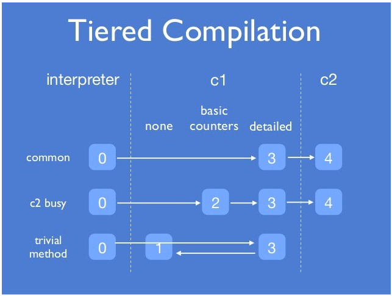
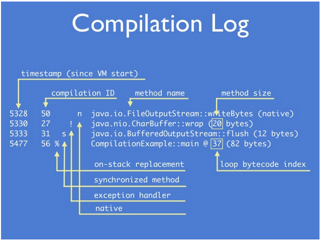

# JVM JIT Compilation

- https://www.lmax.com/blog/staff-blogs/2016/03/05/observing-jvm-warm-effects/
- https://www.slideshare.net/dougqh/jvm-mechanics-when-does-the

- https://stackoverflow.com/questions/35601841/how-does-the-jvm-decided-to-jit-compile-a-method-categorize-a-method-as-hot/35614237#35614237
- https://stackoverflow.com/questions/71318011/how-is-the-count-of-method-executions-that-triggers-the-omitted-exception-stack/71375155#71375155
  (explains `Tier0BackedgeNotifyFreqLog`, `Tier3BackedgeNotifyFreqLog` - the reason why the invocation/backedge counters are not precise)
- https://stackoverflow.com/questions/60851417/jit-recompiles-to-do-fast-throw-after-more-iterations-if-stacktrace-is-of-even-l/60878577#60878577

- http://hg.openjdk.java.net/jdk8u/jdk8u/hotspot/file/2b2511bd3cc8/src/share/vm/runtime/advancedThresholdPolicy.hpp#l34

### Thresholds

```
java -XX:+UnlockDiagnosticVMOptions -XX:+PrintFlagsFinal -version | grep -e Tier
    uintx IncreaseFirstTierCompileThresholdAt      = 50                                        {product} {default}
     bool PrintTieredEvents                        = false                                     {product} {default}
     intx Tier0BackedgeNotifyFreqLog               = 10                                        {product} {default}
     intx Tier0Delay                               = 20                                     {diagnostic} {default}
     intx Tier0InvokeNotifyFreqLog                 = 7                                         {product} {default}
     intx Tier0ProfilingStartPercentage            = 200                                       {product} {default}
     intx Tier23InlineeNotifyFreqLog               = 20                                        {product} {default}
     intx Tier2BackEdgeThreshold                   = 0                                         {product} {default}
     intx Tier2BackedgeNotifyFreqLog               = 14                                        {product} {default}
     intx Tier2CompileThreshold                    = 0                                         {product} {default}
     intx Tier2InvokeNotifyFreqLog                 = 11                                        {product} {default}
     intx Tier3BackEdgeThreshold                   = 60000                                     {product} {default}
     intx Tier3BackedgeNotifyFreqLog               = 13                                        {product} {default}
     intx Tier3CompileThreshold                    = 2000                                      {product} {default}
     intx Tier3DelayOff                            = 2                                         {product} {default}
     intx Tier3DelayOn                             = 5                                         {product} {default}
     intx Tier3InvocationThreshold                 = 200                                       {product} {default}
     intx Tier3InvokeNotifyFreqLog                 = 10                                        {product} {default}
     intx Tier3LoadFeedback                        = 5                                         {product} {default}
     intx Tier3MinInvocationThreshold              = 100                                       {product} {default}
     intx Tier4BackEdgeThreshold                   = 40000                                     {product} {default}
     intx Tier4CompileThreshold                    = 15000                                     {product} {default}
     intx Tier4InvocationThreshold                 = 5000                                      {product} {default}
     intx Tier4LoadFeedback                        = 3                                         {product} {default}
     intx Tier4MinInvocationThreshold              = 600                                       {product} {default}
     bool TieredCompilation                        = true                                   {pd product} {default}
     intx TieredCompileTaskTimeout                 = 50                                        {product} {default}
     intx TieredOldPercentage                      = 1000                                   {diagnostic} {default}
     intx TieredRateUpdateMaxTime                  = 25                                        {product} {default}
     intx TieredRateUpdateMinTime                  = 1                                         {product} {default}
     intx TieredStopAtLevel                        = 4                                         {product} {default}

```

- **CompileThreshold** does make sense if **TieredCompilation** is disabled (Server JIT)

- **IncreaseFirstTierCompileThresholdAt**
```
Increase the compile threshold for C1 compilation if the code 
cache is filled by the specified percentage
```

- **CompileThresholdScaling**
```
Factor to control when first compilation happens 
(both with and without tiered compilation): 
values greater than 1.0 delay counter overflow, 
values between 0 and 1.0 rush counter overflow, 
value of 1.0 leaves compilation thresholds unchanged 
value of 0.0 is equivalent to -Xint. 

Flag can be set as per-method option. 
If a value is specified for a method, compilation thresholds 
for that method are scaled by both the value of the global flag 
and the value of the per-method flag.
```

### Tiered Compilation Phases



### Tier3InvocationThreshold

```
java -XX:+UnlockDiagnosticVMOptions -XX:+PrintFlagsFinal -version | grep Tier3InvocationThreshold
     intx Tier3InvocationThreshold                 = 200                                       {product} {default}
```

```
java -XX:+PrintCompilation -XX:+BackgroundCompilation src/Tier3InvocationThreshold.java 200 | grep Tier3InvocationThreshold
java -XX:+PrintCompilation -XX:+BackgroundCompilation src/Tier3InvocationThreshold.java 255 | grep Tier3InvocationThreshold
java -XX:+PrintCompilation -XX:+BackgroundCompilation src/Tier3InvocationThreshold.java 256 | grep Tier3InvocationThreshold
    457 1214       3       Tier3InvocationThreshold::invoke (6 bytes)
java -XX:+PrintCompilation -XX:+BackgroundCompilation -XX:Tier3InvocationThreshold=1000  src/Tier3InvocationThreshold.java 1023 | grep Tier3InvocationThreshold
java -XX:+PrintCompilation -XX:+BackgroundCompilation -XX:Tier3InvocationThreshold=1000  src/Tier3InvocationThreshold.java 1024 | grep Tier3InvocationThreshold 
    521  900       3       Tier3InvocationThreshold::invoke (6 bytes)
```

- Does it need to be a power of two?? -> `Tier0BackedgeNotifyFreqLog` 2^Tier0BackedgeNotifyFreqLog = 2^10 = 1024

### Tier3BackEdgeThreshold

```
java -XX:+UnlockDiagnosticVMOptions -XX:+PrintFlagsFinal -version | grep Tier3BackEdgeThreshold
     intx Tier3BackEdgeThreshold                   = 60000                                     {product} {default}
```

```
java -XX:+PrintCompilation -XX:+BackgroundCompilation src/Tier3BackEdgeThreshold.java 60415 | grep Tier3BackEdgeThreshold
java -XX:+PrintCompilation -XX:+BackgroundCompilation src/Tier3BackEdgeThreshold.java 60416 | grep Tier3BackEdgeThreshold
    461 1240 %     3       Tier3BackEdgeThreshold::invoke @ 5 (25 bytes)
```

- processed using **On-Stack-Replacement**, switches an implementation of a method (compiled instead of interpreted)
during the method execution (it can be still in the loop)  

### Compilation Log Format



### Tier3CompileThreshold

```
java -XX:+UnlockDiagnosticVMOptions -XX:+PrintFlagsFinal -version | grep -e Tier3MinInvocationThreshold -e Tier3CompileThreshold
     intx Tier3CompileThreshold                    = 2000                                      {product} {default}
     intx Tier3MinInvocationThreshold              = 100                                       {product} {default}
```

- combines `InvocationThreshold` and `BackEdgeThreshold`
- compilation happens when the condition below is met

```
invocationCount > Tier3MinInvocationThreshold && invocationCount + backEdgeCount > Tier3CompileThreshold
```

```
java -XX:+PrintCompilation -XX:+BackgroundCompilation src/Tier3CompileThreshold.java 100 | grep Tier3CompileThreshold                                                      [23/01/8| 6:04PM]
java -XX:+PrintCompilation -XX:+BackgroundCompilation src/Tier3CompileThreshold.java 101 | grep Tier3CompileThreshold                                                      [23/01/8| 6:28PM]
java -XX:+PrintCompilation -XX:+BackgroundCompilation src/Tier3CompileThreshold.java 102 | grep Tier3CompileThreshold                                                      [23/01/8| 6:28PM]
java -XX:+PrintCompilation -XX:+BackgroundCompilation src/Tier3CompileThreshold.java 103 | grep Tier3CompileThreshold                                                      [23/01/8| 6:28PM]
    471 1220       3       Tier3CompileThreshold::invoke (26 bytes)
```